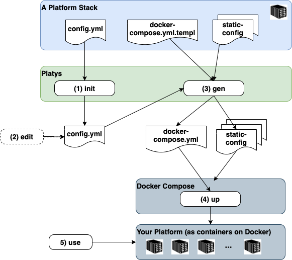

# platys - Trivadis Platform in a Box
Copyright (c) 2018-2024 Trivadis

## What is `platys`?

`platys` is a tool for generating and provisioning Modern Data Platforms based on [Docker](https://www.docker.com/get-started) and [Docker Compose](https://docs.docker.com/compose/). 

Its main use is for small-scale Data Lab projects, Proof-of-Concepts (PoC) or Proof-of-value (PoV) projects as well as trainings.

The user of `platys` can choose which services to use from a list of supported services and generate a fully working `docker-compose.yml` file including all necessary configuration files.

This replaces our old approach, where we only had a static `docker-compose.yml` file with all services enabled by default. By generating the `docker-compose.yml`, the user has very fine-grained control on which services to include for a given platform. 
 
## How does `platys` work?

The following diagram shows the building blocks of `platys` and the basic flow when working with it. 

A concrete _Platform_ is always generated based on a given _Platform Stack_. A platform stack defines the set of available and usable services and has a name and a version. 

The digram shows the 5 necessary steps to create a new platform and use it: 

1. Initialise a new _Platform_ context by specifying a _Platform Stack_. Optionally a set of services to be enabled can be specified with the `init` command. 
2. Optionally edit the `config.yml` to enable services and change default values of configuration settings.
3. Generate the artefacts for the platform (mainly the `docker-compose.yml` but also some configuration files) by running the `gen` command.
4. Run `docker-compose up` to start your platform.
5. Use the services of your platform, once they are stared and ready to use.

Currently there is one supported Platform Stack:

* [`modern-data-platform`](https://github.com/TrivadisPF/platys-modern-data-platform) - a Platform Stack for supporting a Modern (Analytical) Data Platforms

In the future, other platform stacks might be added.

## Why `platys`?

There is no question that running workloads in containers simplifies deployment of applications. But one container is never enough, you need more than one container to implement a working solution, such as database, business logic, event broker ... and you need a Container Orchestration to manage these containers.

Today Kubernetes is the most popular container orchestrator, but it comes with a lot of complexity. For production setups, Kubernetes is definitely one way to go. But for local, development or small-scale Proof-of-Concepts, we like to use Docker Compose, a very simple approach to container orchestration. With Compose, you use a YAML file to configure your application’s services.

Especially as a consultant, coach, trainer, technology evangelist, you will be using different Compose setups for different environments.

The longer you use Docker Compose, the more of these YAML files you get and to maintain them is quite a challenge: 
 
 * But how do you easily upgrade to a new version of a container, i.e. Apache Kafka?
 * Do you manually have to go through all of these Compose files, which is a lot of work and prone to errors? 
 * What if you want to add a new service to one environment and you know that you have used it previously in another environment?
 * Do you copy-paste configs from one YAML to another?
 * How do you make sure that one service from another environment will work with all the configs and port settings of your other environment?

For these and some other challenges we were looking for a better solution: 
 
 * Wouldn't it be easier to generate the Docker Compose YAML, based on a simple configuration with some ON/OFF switches of all supported services? 

Enter the world of `platys`...

## Where can I run `platys`?

`platys` is supported on Windows, macOS and 64-bit Linux. 

Behind the scenes, `platys` runs the generator (supporting given Platform Stack) as a Docker container. Therefore you need to have [Docker](https://www.docker.com/get-started) installed on the machine where you create a Platform. To run the Platform, you also need to have [Docker Compose](https://docs.docker.com/compose/) installed on the target machine, which can be different to the one you use for generating the platform.  

See [Installing platys](./documentation/install.md) for how to install `platys` and then the [Getting Started with Platys and the Modern Data Platform Stack](https://github.com/TrivadisPF/platys-modern-data-platform/blob/master/documentation/getting-started.md) for how to use `platys`.

## Where can I run a generated platform ?

The generated platform can be provisioned either locally or in the cloud. See [Provisioning of Modern Data Platform](./documentation/environment/README.md) for various versions of how to deploy the platform. 

## Changes 
See [What's new?](./documentation/changes.md) for a detailed list of changes.

## Documentation

**Usage**

* [Installing platys](./documentation/install.md)
* [Provisioning a platys-ready environment](./documentation/environment/README.md)
* [Getting Started with `platys` and the `modern-data-platform` platform stack](https://github.com/TrivadisPF/platys-modern-data-platform/blob/master/documentation/getting-started.md)
* [Frequently Asked Questions](./documentation/faq.md)
* [Command line reference](./documentation/command-line-ref.md)
* [Glossary of Terms](./documentation/glossary.md)
* [How to use a platys-generated stack without Internet](./documentation/docker-compose-without-internet.md)

**Development**

* [Service Design Decisions](./documentation/service-design.md)
* [Creating and maintaining a Platform Stack](./documentation/creating-and-maintaining-platform-stack.md)

**Platform Stacks**

* [Adding additional services not supported by a Platform Stack](./documentation/docker-compose-override.md)
* [Upgrade to a new platform stack version](./documentation/upgrade-platform-stack.md)

