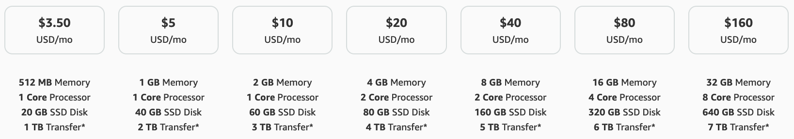
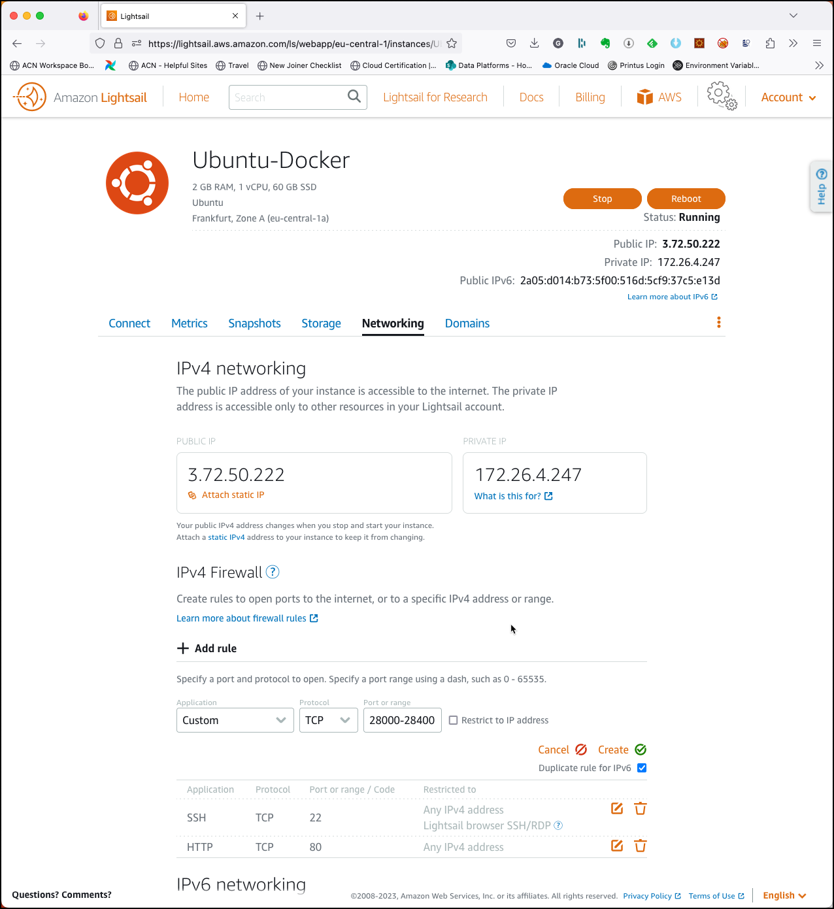

# Provision a `platys`-ready environment on Amazon Lightsail

Amazon Lightsail offers easy-to-use virtual private server (VPS) instances, containers, storage, databases, and more at a cost-effective monthly price. It allows to easily create and delete development sandboxes and test environments where you can try out new ideas, risk free. By that it is very well-suited for Platys-based environment and its simple provisioning allows for a (almost) 1-click install. Depending on the sizing of the stack, you can choose form the following "T-shirt sizes":



Below 4GB of Memory probably doesn't make a lot of sense for a docker-compose stack, so price starts at USD 20 per month. But it is important to state, that you only pay for the minutes you use the VM, if you remove it after a day of usage, you only pay for the day. 

**Note:** you have to terminate the instance to stop the metering, if you only stop the instance, then you will still have to pay for it. You can also use snapshotting to save the state of an instance in a cheaper way and from that snapshot you can later re-create a new instance. Snapshotting is also the way to choose if you want to scale up the instance (to a larger T-Shirt size). 

## Provision a `platys`-ready Lightsail VM 

Navigate to the [AWS Console](http://console.aws.amazon.com) and login with your user. Click on the [Lightsail service](https://lightsail.aws.amazon.com/ls/webapp/home/instances).


## Provision instance

Click **Create instance** to navigate to the **Create an instance** dialog. 


Optionally change the **Instance Location** to a AWS region of your liking.
Keep **Linux/Unix** for the **Select a platform** and click on **OS Only** and select **Ubuntu 18.04 LTS** for the **Select a blueprint**. 


Scroll down to **Launch script** and add the following script 

```bash
export PLATYS_VERSION=2.4.0
export NETWORK_NAME=ens5
export USERNAME=ubuntu
export PASSWORD=abc123!

# Prepare Environment Variables 
export PUBLIC_IP=$(curl ipinfo.io/ip)
export DOCKER_HOST_IP=$(ip addr show ${NETWORK_NAME} | grep "inet\b" | awk '{print $2}' | cut -d/ -f1)

# allow login by password
sudo sed -i "s/.*PasswordAuthentication.*/PasswordAuthentication yes/g" /etc/ssh/sshd_config
echo "${USERNAME}:${PASSWORD}"|chpasswd
sudo service sshd restart

# add alias "dataplatform" to /etc/hosts
echo "$DOCKER_HOST_IP     dataplatform" | sudo tee -a /etc/hosts

# Install Docker
sudo apt-get update
sudo apt-get install \
    ca-certificates \
    curl \
    gnupg \
    lsb-release
sudo mkdir -p /etc/apt/keyrings    
curl -fsSL https://download.docker.com/linux/ubuntu/gpg | sudo gpg --dearmor -o /etc/apt/keyrings/docker.gpg
echo \
  "deb [arch=$(dpkg --print-architecture) signed-by=/etc/apt/keyrings/docker.gpg] https://download.docker.com/linux/ubuntu \
  $(lsb_release -cs) stable" | sudo tee /etc/apt/sources.list.d/docker.list > /dev/null

sudo apt-get update
sudo apt-get install -y docker-ce docker-ce-cli containerd.io docker-compose-plugin
sudo usermod -aG docker $USERNAME

# Install Docker Compose Switch
sudo curl -fL https://github.com/docker/compose-switch/releases/latest/download/docker-compose-linux-amd64 -o /usr/local/bin/compose-switch
chmod +x /usr/local/bin/compose-switch
sudo update-alternatives --install /usr/local/bin/docker-compose docker-compose /usr/local/bin/compose-switch 99

# Install Platys
sudo curl -L "https://github.com/TrivadisPF/platys/releases/download/${PLATYS_VERSION}/platys_${PLATYS_VERSION}_linux_x86_64.tar.gz" -o /tmp/platys.tar.gz
tar zvxf /tmp/platys.tar.gz 
sudo mv platys /usr/local/bin/
sudo chown root:root /usr/local/bin/platys
sudo rm /tmp/platys.tar.gz 

# Install various Utilities
sudo apt-get install -y curl jq unzip

# needed for elasticsearch
sudo sysctl -w vm.max_map_count=262144   

# Make Environment Variables persistent
sudo echo "export PUBLIC_IP=$PUBLIC_IP" | sudo tee -a /etc/profile.d/platys-platform-env.sh
sudo echo "export DOCKER_HOST_IP=$DOCKER_HOST_IP" | sudo tee -a /etc/profile.d/platys-platform-env.sh
sudo echo "export DATAPLATFORM_HOME=$PWD" | sudo tee -a /etc/profile.d/platys-platform-env.sh
```

into the **Launch Script** edit field
 


Click on **Change SSH key pair** and leave the **Default** selected and then click on **Download** and save the file to a convenient location on your machine. Under **Choose your instance plan** click on the arrow on the right and select the **16 GB** instance.   

Under **Identify your instance** enter **Ubuntu-Analytics-Platform** into the edit field. 


Click on **Create Instance** to start provisioning the instance. 

The new instance will show up in the Instances list on the Lightsail homepage. 


Click on the instance to navigate to the image details page. On the right you can find the Public IP address **18.196.124.212** of the newly created instance.


Next we have to configure the Firewall to allow traffic into the Lightsail instance. 

Click on the **Networking** tab/link to navigate to the network settings and under **Firewall** click on **+ Add another**.
We allow TCP traffic on ports 28000 - 28200 by selecting **Custom**, entering **28000 - 28200** into the **Port range** field and then click **Save**. 



Now let's see how the provisioning of the lightsail instance is doing. 
Navigate to the **Connect** tab and click **Connect using SSH** to open the console and enter the following command to watch the log file of the init script.

```
tail -f /var/log/cloud-init-output.log --lines 1000
```

The initialisation is finished when you see the `Creating xxxxx .... done` lines after all the docker images have been downloaded, which takes a couple of minutes. 


Optionally you can also SSH into the Lightsail instance using the **SSH key pair** you have downloaded above. For that open a terminal window (on Mac / Linux) or Putty (on Windows) and connect as ubuntu to the Public IP address of the instance.   

```
ssh -i LightsailDefaultKey-eu-central-1.pem ubuntu@18.196.124.212 
```

Your instance is now ready to use. Complete the post installation steps documented the [here](README.md).

## Using the `platys`-ready environment
 
Now you are ready to use the Platys environment. You can follow the [Getting Started with `platys` and the `modern-data-platform` stack](https://github.com/TrivadisPF/platys-modern-data-platform/blob/master/documentation/getting-started.md) to see how to create a `modern-data-platform` stack. 

Or [click here](command-line-ref.md) to explore the full list of platys commands.

## Create a Static IP

You can also create a static IP and assign it to your instance so that the IP won't change in case you have to restart the VM.

## Stop an Instance

To stop the instance, navigate to the instance overview and click on the drop-down menu and select **Stop**. 


Click on **Stop** to confirm stopping the instance. 


A stopped instance will still incur charges, you have to terminate (delete) the instance completely to stop charges. 

## Terminating an Instance

To terminate the instance, navigate to the instance overview and click on the drop-down menu and select **Delete**. 


Click on **Delete** to confirm terminating the instance. 

## Create a snapshot of an Instance

When an instance is stopped, you can create a snapshot, which you can keep, even if later drop the instance to reduce costs.


You can always recreate an instance based on a snapshot. 

